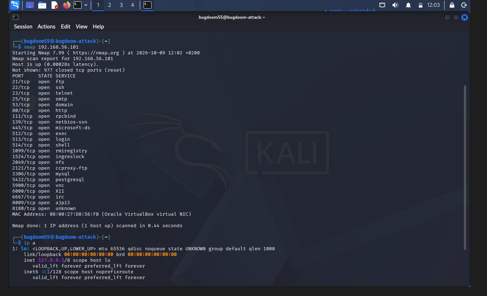

# Welcome to the english version of my e-portfolio

# Introduction

My name is Skander Badri and this is my e-portfolio. I am a computer science student at ENSEEIHT in my first year (Bac+3) and I am looking
forward to learning new things, widening my horizons and discover the world of Cybersecurity !

[Return to the main page](../README.md)

# Engineering Course
* ## *Home lab* project
<figure>
  
  <figcaption>Figure 1: Port scanning Metasploitable 2</figcaption>
</figure>
* ## *Guessing game* remastered

# International Mobility
# Sustainability & Civic Engagement
# Sport & other activities
# Career Development